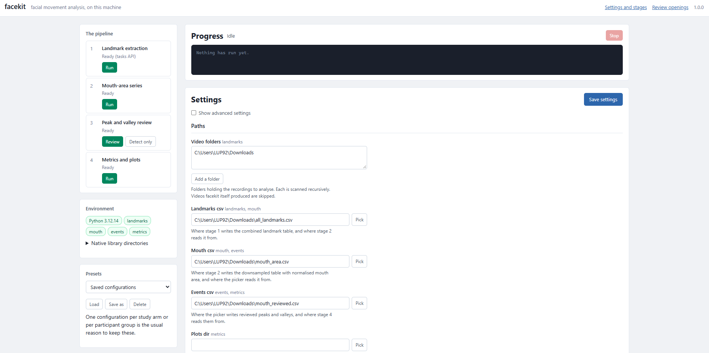
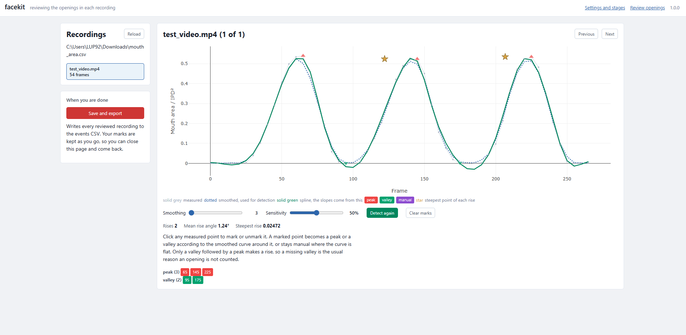

# facekit

Facial landmark extraction, mouth-area analysis and left-right movement
metrics for clinical video, behind one local interface.

facekit brings together four things researchers usually do with four separate
scripts. It finds the facial landmarks in a recording, turns the mouth into a
measurable area over time, lets you review which movements in that signal are
the ones you asked for, and measures how far and how fast each side of the
face moved. Each stage works on its own, and together they describe one
recording from video to per-side asymmetry.

It runs entirely on your own machine. No video is uploaded anywhere.



*Choosing the render mode, which determines what stage 1 writes alongside the
landmark table.*



*Reviewing detected openings: click to mark or unmark, adjust smoothing and
sensitivity, export a reviewed CSV.*

---

## What it does

**Landmark extraction.** Runs [MediaPipe Face Mesh](https://ai.google.dev/edge/mediapipe/solutions/vision/face_landmarker)
over whole recordings and writes 468 landmarks per frame, or 478 with the
irises included. Alongside the table it can render the mesh over the recording,
so you can check the tracking against the face, or onto black, which gives you
something shareable that does not show the participant. Results come out as one
CSV per input folder plus a combined table.

**Mouth-area series.** Turns the inner-lip contour into an area with the
shoelace formula and divides it by the squared inter-pupil distance, which
removes the participant's distance from the camera. The series is then
downsampled: one representative frame in five carries the average over its own
window, so the signal is condensed rather than sampled.

**Peak and valley review.** Finds the openings with a prominence threshold
derived from each recording's own spread, then opens a picker in the browser
where you can see the fitted curve, adjust smoothing and sensitivity, and click
individual frames to mark or unmark them. Automatic detection marks swallows,
speech and camera wobble as readily as the movement you asked for, which is why
the picker exists. Each valley-to-peak rise is measured as the steepest point of
a smoothing spline's derivative, not as the straight line between the two
markers.

**Metrics and plots.** Rotates every frame so the eye line is horizontal, then
measures inner-mouth area, corner displacement, corner angle, half-area and
vertical lip opening, each reported separately for the left and right side.
Results come out as one CSV of every measured frame plus a tree of strip plots,
one point per measurement with a summary bar per session.

---

## Requirements

Python **3.10 to 3.12**. Use 3.11 or 3.12 if you are choosing.

- Below 3.10 the syntax used here does not parse.
- On 3.13 and later, everything installs except `mediapipe`, which publishes no
  wheels above 3.12. Stages 2 to 4 will run; stage 1 will not. If your landmark
  tables were produced elsewhere, a 3.13 environment is fine.

Works on Windows, macOS and Linux. No GPU is needed. Landmark extraction is
the slow stage and runs at roughly real time on a recent laptop CPU, so a
ten-minute recording takes about ten minutes.

### Which MediaPipe you get

MediaPipe has two generations of face-mesh API, and which one your version
exposes is not something you can tell from the version number alone:

| | `solutions` | `tasks` |
| --- | --- | --- |
| Entry point | `mp.solutions.face_mesh.FaceMesh` | `vision.FaceLandmarker` |
| Model | built in | a 3 MB `.task` file, fetched once |
| Landmarks | 468, or 478 refined | always 478 |
| Status | deprecated, absent from some 0.10.x builds | current |

facekit uses whichever is present, preferring `solutions` because it needs no
download and reproduces earlier output exactly. `python -m facekit env` reports
which you have. Set **Mesh backend** to pin one.

If you are installing fresh and get a build with only `tasks`, the first
landmark run downloads the model to `~/.facekit/models`. That is the only step
in facekit that touches the network. If it is blocked, the error names the URL
and the path to save it to, and every later run works offline.

---

## Install

With conda, which is the easier route on Windows:

```
conda env create -f environment.yml
conda activate facekit
```

With pip, into a Python 3.11 or 3.12 environment:

```
python -m venv .venv
source .venv/bin/activate          # Windows: .venv\Scripts\activate
pip install -r requirements.txt
```

Then check the install:

```
python -m facekit env
```

That prints your Python version and, for each of the four stages, whether its
dependencies are present and which are missing. The interface shows the same
thing as chips in the sidebar.

### Installing only part of it

The stages have separate dependencies, so you don't have to install mediapipe
to work on landmark tables somebody else produced:

```
pip install -e ".[mesh]"    # landmark extraction
pip install -e ".[plots]"   # the figures
pip install -e ".[all]"     # everything
```

The mouth-area and event stages need only what the core installs.

---

## Running it

```
python run_interface.py
```

Or equivalently `python -m facekit`. On Windows you can double-click
`start_windows.bat`. A browser opens at <http://127.0.0.1:7332>.

The port is 7332 rather than speechkit's 7331, so both can run at once.

Everything is set from the interface, including every input and output path, so
there is nothing to edit in the source. Settings are saved to
`~/.facekit/settings.json` and reloaded next time.

Settings are read from that file, not from the form, so an edit has to be saved
before a stage can see it. Running a stage saves first, and so does leaving the
page, and the Save settings button carries an asterisk while anything is
unsaved. The one thing to know is that a path you have typed but not saved is
not yet the path facekit will use.

---

## The pipeline, in order

Each stage reads what the one before it wrote, so the order is not optional.
What is optional is doing them in one sitting: every stage writes a file, and
the next one picks that file up whenever you come back to it.

1. **Extract landmarks.** Point it at one or more folders of recordings, choose
   a render mode, and run it. This is the stage that takes hours; start it and
   leave it.
2. **Compute the mouth area.** Reads the landmark table, writes the downsampled
   series. Seconds to a minute.
3. **Review the openings.** Open the review page, work through the recordings,
   then export. This is the stage that takes your attention.
4. **Measure and plot.** Reads the reviewed events, writes the metrics CSV and
   the plot tree.

From the command line:

```
python -m facekit landmarks FOLDER [FOLDER ...] -o landmarks.csv
python -m facekit mouth landmarks.csv -o mouth.csv
python -m facekit review                            # opens the picker
python -m facekit metrics events.csv -o ./plots
```

There is also `python -m facekit events mouth.csv -o events.csv`, which detects
without review. It is for batch work and for getting a first look at a dataset,
not for results. An unreviewed export will contain peaks on swallows and on
speech, and there is nothing in the output that tells you which.

### What the review step needs, and what it remembers

The picker reads whatever file is set as **Mouth csv** under Paths. It does not
depend on stage 2 having run in the same session, so you can run the numeric
stages overnight from the command line and review in the morning.

Your marks are saved as you make them, under `~/.facekit/review`, keyed by the
input file's path. Closing the page or restarting the interface does not lose
them; the sidebar shows which recordings you have already been through and
opens the first one you have not. **Save and export** writes every reviewed
recording to the events CSV.

Recordings you never open are not in the export. That is deliberate: a
recording with no marks and a recording you decided had no usable movement look
identical in a CSV, so facekit only writes what you actually looked at.

---

## Settings

Every value that used to be a constant edited in the source is in the
interface, grouped by what it affects, with the original explanation as help
text. Advanced settings are hidden behind a toggle. Each field is labelled with
the stages that read it, so you can tell at a glance whether a setting matters
for the run you are about to start.

Four are worth knowing about before your first real run.

**Refine landmarks** has to stay on unless you have a specific reason. It adds
the iris landmarks, and the iris landmarks are what every normalisation in
facekit divides by. With it off there is no inter-pupil distance, so stage 2
fails rather than quietly producing pixel areas that cannot be compared between
sessions.

**Keep every n** is the downsampling interval, and it is the setting most
likely to invalidate a rise slope. Amplitudes tolerate coarse sampling; slopes
do not, because a slope is a derivative and a derivative needs several samples
across the edge it is measured on.

On a synthetic signal with a known answer, the spline recovers the true
steepest slope to within 3% given five or more representative frames per rise,
and falls apart below that:

| Samples per rise | Recovered slope | Rises flagged |
| ---------------- | --------------- | ------------- |
| 10 | 103% of the true value | none |
| 5 | 101% | none |
| 2 | 28% | 6 of 27 |
| 1 | nonsense | all 27 |

So the interval you can afford depends on how fast the movement is. Divide the
length of one opening, in frames, by five: that is the largest interval that
still measures its slope. A 10-frame opening at 30 fps needs an interval of 2.
Amplitudes are unaffected either way, and the area is computed on every frame
and averaged into the window regardless, so the cost of a small interval is
review time rather than accuracy.

facekit will tell you when it has gone wrong rather than leaving you to notice.
See the note on over-smoothed rises under Outputs.

**Mirror mode** decides whether the columns named left describe the
participant's left. It affects only the two half-area measures, which are
geometric; every other left and right comes from the landmark itself and is
already correct either way. The default derives the side from where the
labelled mouth corners actually fall, which is right unless the head is turned
far enough that both corners sit on one side of the midline. Check it once per
camera setup and then leave it alone.

**Central tendencies** is the one setting that changes what conclusion you will
draw. `median` is robust to a participant giving up halfway through a take.
`robust_mean` averages the interquartile range, dropping the top and bottom
quarter, which is closer to typical effort. Both are produced by default, into
separate folders containing the same plots, so you can look at both before
deciding which to report. Decide before you look, if you can.

Use the presets box in the sidebar to save a whole configuration by name, which
is the easiest way to keep one setup per study arm or per participant group.

---

## Outputs

Stage 1 writes the landmark table, one row per landmark per frame:

| Column | Contents |
| ------ | -------- |
| `folder`, `video`, `frame`, `face_id` | which recording and when |
| `landmark_id` | 0 to 467, or 477 with irises |
| `x_norm`, `y_norm`, `z_norm` | mesh coordinates, 0 to 1 |
| `x_pixel`, `y_pixel` | the same points in pixels |

A frame where no face was found writes one blank row per landmark rather than
no rows, so the row count stays an exact multiple of the landmark count and a
dropout is visible. The run reports whether that multiple came out exact.

Stage 2 writes the same columns for the representative frames, plus:

| Column | Contents |
| ------ | -------- |
| `inner_mouth_area_avg_px2` | mouth area in pixels, averaged over the window |
| `interpupil_dist_avg_px` | inter-pupil distance, averaged over the window |
| `mouth_area_norm_avg` | area divided by the squared inter-pupil distance |
| `frames_in_window`, `frames_usable` | how much of the window was measurable |

Stage 3 keeps only the frames you marked and adds:

| Column | Contents |
| ------ | -------- |
| `point_type` | `peak`, `valley` or `manual` |
| `rise_slope_max` | steepest point of the spline derivative on the rise |
| `rise_angle_deg` | `atan` of that slope, in degrees |
| `rise_slope_diag`, `rise_angle_diag_deg` | the straight valley-to-peak line |
| `rise_valley_frame`, `rise_delta_frame`, `rise_delta_area` | the rise itself |
| `mean_rise_angle_deg` | mean over the recording, on every row of it |
| `rise_oversmoothed` | true when this rise's slope cannot be trusted |

The rise columns are populated on peak rows only, because a rise belongs to the
peak that ends it.

**`rise_oversmoothed`** is a self-check worth understanding, because it is the
one column that tells you a number in the same row is wrong. The maximum of a
derivative across an interval cannot be less than the average rate of change
across it; that is the mean value theorem. So whenever `rise_slope_max` comes
out below `rise_slope_diag`, the spline is demonstrably not following the data,
and the flag is set. The usual cause is too few samples across the rise, which
means a lower **Keep every n**. Filter these rows out before reporting slopes,
or read `rise_slope_diag`, which underestimates but stays valid. The run log
reports how many were flagged.

Stage 4 writes, into your chosen output folder:

| File | Contents |
| ---- | -------- |
| `all_frame_metrics.csv` | every measure, one row per reviewed frame |
| `<tendency>/<task>/` | one strip plot per measure |
| `best_quartile/<tendency>/<task>/` | the same, from each group's best quartile |

Plot filenames are `metrics_<task>_<measure>.pdf`, and left-right pairs are
named `metrics_<task>_left_x_vs_right_x.pdf`.

---

## Command line

Useful for batch work and for scripting around the tool. Anything not given on
the command line comes from the saved settings, so the interface and the
command line always agree.

```
python -m facekit env                    # check the install
python -m facekit settings               # print current settings as JSON
python -m facekit settings --describe    # every setting, with its help text

python -m facekit landmarks FOLDER -o LANDMARKS.csv
python -m facekit mouth LANDMARKS.csv -o MOUTH.csv
python -m facekit events MOUTH.csv -o EVENTS.csv
python -m facekit review
python -m facekit metrics EVENTS.csv -o PLOTS_DIR
python -m facekit serve --port 8080
```

Every setting is addressable by its upper-case name:

```
python -m facekit landmarks ./session_0309 -o ./out.csv \
  --set RENDER_MODE=mask --set MIN_DETECTION_CONFIDENCE=0.5
```

Add `--preset NAME` to load a saved configuration first, and `--save` to write
the result back as the new defaults.

### As a library

```
from facekit import settings
from facekit.landmarks import run as extract_landmarks
from facekit.mouth import run as compute_mouth_area
from facekit.events import detect, compute_rises
from facekit.metrics import compute_metrics, frame_metrics

values = settings.load({"KEEP_EVERY_N": 1})
compute_mouth_area(values, in_csv="landmarks.csv", out_csv="mouth.csv")
```

Every `run()` takes `values`, an input and an output, and optionally `log` and
`should_stop` callbacks. That is the whole interface the web app uses, so
anything the interface can do is scriptable.

---

## Project layout

```
facekit/
  settings.py        every tunable value, with type, default and help text
  landmarks.py       video decoding, rendering and the landmark table
  mesh/              the two MediaPipe APIs behind one interface
  mouth.py           inner-mouth area, normalised by inter-pupil distance
  events.py          peak and valley detection, spline rise slopes, export
  metrics.py         head-roll correction, left-right geometry, strip plots
  jobs.py            background runner, so long batches stream progress
  cli.py             command line
  _winsetup.py       native library paths on Windows
  web/               Flask app, the settings page and the review picker
```

The interface is generated from `settings.py`. Exposing a new option means
adding one line there; there is no field list in the HTML and no argument list
in the CLI to keep in step.

Detection and slope measurement live in `events.py` and nowhere else. The
review page asks the server what it would find and draws the answer. This is
the one structural decision worth explaining: the scripts facekit replaces
computed slopes twice, once in JavaScript for the figure and once in Python for
the export, and the two could disagree about the number written next to a
marker you were looking at.

---

## Troubleshooting

**`ModuleNotFoundError` for mediapipe, cv2, matplotlib.** Run
`python -m facekit env`. It names the missing packages and the exact pip
command.

**A stage's run button is greyed out.** Its dependencies are missing; the chip
in the sidebar shows the install command on hover.

**`DLL load failed while importing _framework_bindings` on Windows.** facekit
derives the native library directories from the Python that is running, so this
should not happen. If it does, point it at the folder holding the DLLs:

```
set FACEKIT_DLL_DIRS=C:\path\to\env\Library\bin
```

Separate multiple folders with `;`. The interface lists the directories it
registered in the environment panel.

**The rendered video will not play in the browser.** OpenCV could not open the
`avc1` encoder and fell back to `mp4v`, which the console reports at the time.
`mp4v` files play in VLC but not in Chrome. Either install an OpenCV build with
H.264 support, or set Render mode to `none` and check the tracking in VLC.

**`PermissionError: [Errno 13] Permission denied` naming a folder.** Almost
always a path field holding a folder where a file is needed. Windows reports
opening a directory for writing as a permission error, so the message names the
folder and nothing else. facekit now completes a folder with the setting's
natural filename and says so in the log, so this should not reach you; if it
does, the other causes are the file being open in Excel, which locks it, or the
folder being managed by OneDrive or covered by Windows controlled folder
access. Writing somewhere under your own user folder avoids both.

**A recording produced no rows.** No face was detected in any frame. Check the
render output: if the mesh is on the wrong face, lower Max faces to 1 and leave
Principal face only on. If there is no mesh at all, lower Min detection
confidence to 0.5 and try again; 0.7 is strict for a participant in profile or
under poor lighting.

**"Every frame came out unusable" from stage 2.** Refine landmarks was off when
stage 1 ran, so there are no iris landmarks to normalise by. There is no way to
recover this from the table; stage 1 has to run again.

**Stage 2 wrote nothing.** No frame number in the input was a multiple of Keep
every n. This happens with a landmark table that starts at frame 1, or one
assembled from several sources.

**The review page says nothing to review.** It reads the file set as Mouth csv,
and the error message names the path it tried. If that path is not the one you
just typed, the settings were not saved: the Save settings button shows an
asterisk while there are unsaved changes, and every route off the settings page
saves first.

**The export says none of the selected frames were found.** The picker was
loaded from a different file than the one now configured under Paths. Reload
the recording list and review again, or point Mouth csv back at the file you
reviewed against.

**A plot is missing from the output.** Check the log for a line beginning
`skipping`. Rise-slope plots need the `rise_slope_max` column, which only exists
if the input came from the review step.

**Port 7332 is in use.** Change it under Server in the interface, or
`python -m facekit serve --port 8080`.

**Landmark extraction is slower than real time.** Set Render mode to `none`,
which roughly doubles the throughput; the mesh render is most of the per-frame
cost once the model is warm.

---

## Data protection

The interface has no authentication and its file browser can see the whole
filesystem. That is appropriate for a tool running on your own machine and
unacceptable on a shared network interface, so it binds to `127.0.0.1` by
default. Do not change that unless you know what you are doing.

`.gitignore` refuses video, CSV and PDF files so that participant recordings
and derived data cannot be committed by accident. Note that a landmark table is
not anonymous: 478 points per frame is a face, and it can be rendered back into
a recognisable one. Treat those CSVs the way you treat the video. The mask
renders are no better in this respect: they show no skin, but the mesh is still
the participant's face shape, and anyone who knows them may recognise it.

If you fork this for your own study, check `git status` before your first push,
and remember that absolute paths saved in settings can themselves identify a
study or a participant.

---

## Known limitations

**MediaPipe was not trained on facial palsy.** The mesh is fitted with a strong
prior toward a symmetric face, and a strongly asymmetric one is pulled toward
the average. This biases every asymmetry measure in facekit toward zero,
meaning real asymmetry is underestimated by an unknown amount. It does not
prevent detecting a change within a participant over time, which is what these
measures are normally used for, but it does undermine comparing an absolute
asymmetry against a published threshold. Check the render output on your most
affected participant before trusting any single-session number.

**The z coordinate is not a depth measurement.** It is recorded because
MediaPipe provides it, and nothing in facekit uses it. It is roughly scaled to
image width with an origin near the head centre, and it is not metric.

**Head pose beyond roll is uncorrected.** Rotating the eye line to horizontal
removes roll. Yaw and pitch are not corrected, and both compress the mouth in
the image plane, so a participant who turned toward the camera between sessions
will appear to have opened wider. The inter-pupil distance shrinks with yaw,
which partly cancels this, but only partly and not predictably. Keep the camera
position fixed across sessions and this stops being the largest source of
variance.

**Peak-valley pairing is positional.** Amplitudes pair the first peak with the
first valley, the second with the second, and so on within each recording. This
is correct when peaks and valleys alternate, which the picker enforces by
default. Turn `ENFORCE_ALTERNATING` off and the pairing will silently pair
across a gap.

**The task and stimulus come from the filename.** `smile_post.mp4` in a folder
called `0309` is parsed as task `smile`, stimulus `POST`, session `0309`. If
your naming differs, the grouping will be wrong in ways the plots will not flag.
Turn Task from filename off to treat a folder as one task, or rename.

**Session ordering is numeric where it can be.** Folder names like `0309` and
`1014` sort correctly as numbers within a year and incorrectly across one.
Folders named `20260309` sort correctly always.

---

## Credits

This tool stands on:

- **MediaPipe Face Mesh**, Google, Apache-2.0. Every measurement here is
  derived from its landmarks; the geometry and its accuracy are MediaPipe's.
  Described in *Real-time Facial Surface Geometry from Monocular Video on
  Mobile GPUs*, Kartynnik, Ablavatski, Grishchenko and Grundmann,
  [arXiv:1907.06724](https://arxiv.org/abs/1907.06724).
- **OpenCV** for video decoding and encoding.
- **NumPy**, **SciPy**, **pandas**, **matplotlib** and **Flask**.
- **Plotly** for the chart on the review page, loaded from a CDN. That is the
  one thing here that makes a network request; the review page works offline if
  you vendor `plotly.min.js` into `facekit/web/static` and point the template at
  it.

Please cite MediaPipe and the face mesh paper alongside this tool when you
report results that depend on them.

---

## Citation

Author and version metadata live in [`CITATION.cff`](CITATION.cff), which
GitHub reads to put a **Cite this repository** button in the sidebar. Editing
that file is enough; the button and the BibTeX below stay in step with it.

```
@software{facekit,
  author    = {Luca Pivetti},
  title     = {facekit: facial landmark extraction, mouth-area analysis
               and left-right movement metrics for clinical video},
  year      = {2026},
  version   = {1.0.0},
  doi       = {10.5281/zenodo.22775433},
  url       = {https://github.com/Pivaz-01/facekit}
}
```

facekit is a wrapper around other people's work. When you report results, cite
those too, not only this tool:

- **MediaPipe Face Mesh**, Kartynnik, Ablavatski, Grishchenko and Grundmann,
  [arXiv:1907.06724](https://arxiv.org/abs/1907.06724), for every landmark
- **NumPy**, Harris et al., *Nature* 585 (2020),
  [doi:10.1038/s41586-020-2649-2](https://doi.org/10.1038/s41586-020-2649-2)

Both are listed as `references` in `CITATION.cff`.

## License

GNU General Public License v3.0 or later. See [LICENSE](LICENSE).

Nothing here requires GPL-3. Every dependency is permissively licensed:
MediaPipe and OpenCV are Apache-2.0, the scientific stack is BSD. The license
matches [speechkit](https://github.com/Pivaz-01/speechkit) so that the pair is
under one license, which is a convenience rather than an obligation. If you
would rather have a permissive license, this is the one file to change and
there is no dependency standing in the way.

## Contributing

Issues and pull requests are welcome, particularly reports of what happens on
recording setups and clinical populations this has not been tried on. If you
add a setting, add it to `facekit/settings.py` and the interface will pick it
up.
